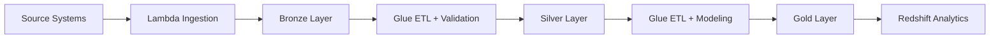
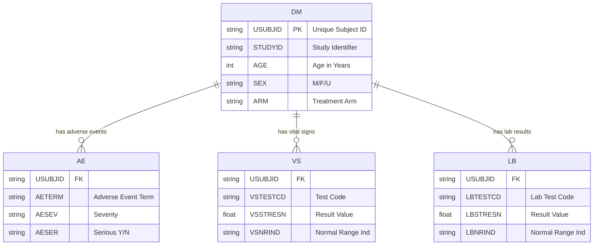

<div align="center">

# 🏥 Clinical Trial Data Platform

### Production-Grade Data Engineering for Pharmaceutical R&D

[](https://github.com/Wrek34/clinical-trial-data-platform/actions/workflows/ci.yml)
&nbsp;
[](https://www.terraform.io/)
&nbsp;
[](https://aws.amazon.com/)
&nbsp;
[](https://www.python.org/)
&nbsp;
[](https://www.cdisc.org/)

<br/>

[Features](#-features) •
[Architecture](#%EF%B8%8F-architecture) •
[Quick Start](#-quick-start) •
[Documentation](#-documentation)

</div>

---

## 🎯 Overview

A **production-grade data platform** for pharmaceutical clinical trials that transforms raw study data into regulatory-compliant, analytics-ready datasets.

<table>
<tr>
<td width="50%">

### The Challenge

Clinical trial data engineering is uniquely complex:

- 📋 **Regulatory Compliance** - FDA 21 CFR Part 11
- 📊 **Data Standards** - CDISC SDTM mandatory
- ✅ **Data Quality** - Patient safety depends on it
- 📈 **Scale** - Millions of data points per study

</td>
<td width="50%">

### The Solution

This platform addresses all four:

- 🔒 **Complete Audit Trails** - Every change tracked
- 🏷️ **CDISC Native** - Built for SDTM from day one
- 🛡️ **20+ Validation Rules** - Automated quality gates
- ☁️ **Serverless Scale** - Pay only for what you use

</td>
</tr>
</table>

---

## ✨ Features

| Feature | Description |
|:--------|:------------|
| 🗄️ **Medallion Architecture** | Bronze → Silver → Gold data layers for audit compliance |
| ✅ **Data Quality Framework** | 20+ automated validation rules with quarantine workflow |
| 📊 **Data Lineage Tracking** | Complete audit trail from source to analytics |
| 🏷️ **CDISC SDTM Compliance** | FDA/EMA regulatory submission ready |
| ⚡ **Serverless Processing** | Lambda ingestion, Glue ETL, Redshift analytics |
| 🏗️ **Infrastructure as Code** | 100% Terraform, reproducible deployments |

---

## 🏗️ Architecture

```
┌─────────────────────────────────────────────────────────────────────────────┐
│                        CLINICAL TRIAL DATA PLATFORM                         │
├─────────────────────────────────────────────────────────────────────────────┤
│                                                                             │
│   ┌──────────┐      ┌─────────────────────────────────────────────────┐    │
│   │  SOURCE  │      │               AWS DATA LAKE (S3)                │    │
│   │ SYSTEMS  │      │                                                 │    │
│   │          │      │   ┌─────────┐   ┌─────────┐   ┌─────────┐      │    │
│   │ • EDC    │ ───▶ │   │ BRONZE  │──▶│ SILVER  │──▶│  GOLD   │      │    │
│   │ • Labs   │      │   │  (Raw)  │   │(Valid)  │   │(Serving)│      │    │
│   │ • Devices│      │   └─────────┘   └─────────┘   └─────────┘      │    │
│   └──────────┘      │        │             │             │           │    │
│                     │        ▼             ▼             ▼           │    │
│                     │   ┌─────────────────────────────────────────┐  │    │
│                     │   │     Lambda  │  Glue ETL  │  Redshift   │  │    │
│                     │   └─────────────────────────────────────────┘  │    │
│                     └─────────────────────────────────────────────────┘    │
│                                                                             │
│   ┌─────────────────────────────────────────────────────────────────────┐  │
│   │  📋 Validation    📊 Lineage    🔐 IAM    📈 CloudWatch    🏷️ CDISC │  │
│   └─────────────────────────────────────────────────────────────────────┘  │
└─────────────────────────────────────────────────────────────────────────────┘
```

### Data Flow



### Medallion Architecture

| Layer | Purpose | Retention | Key Feature |
|:------|:--------|:----------|:------------|
| 🥉 **Bronze** | Raw data preservation | 7 years | Immutable audit trail |
| 🥈 **Silver** | Validated & standardized | 7 years | CDISC SDTM compliant |
| 🥇 **Gold** | Analytics-ready | Rebuildable | Dimensional model |

---

## 🔬 CDISC Domains



| Domain | Description | Key Variables | Validation Rules |
|:-------|:------------|:--------------|:-----------------|
| **DM** | Demographics | `USUBJID`, `AGE`, `SEX`, `ARM` | 6 rules |
| **AE** | Adverse Events | `AETERM`, `AESEV`, `AESER` | 5 rules |
| **VS** | Vital Signs | `VSTESTCD`, `VSSTRESN`, `VSNRIND` | 4 rules |
| **LB** | Lab Results | `LBTESTCD`, `LBSTRESN`, `LBNRIND` | 4 rules |

---

## 📊 Sample Analytics

The Gold layer enables clinical trial analytics like:

### Adverse Event Analysis by Treatment Arm

```sql
SELECT 
    treatment_arm,
    ae_preferred_term,
    severity,
    COUNT(*) as event_count,
    COUNT(DISTINCT usubjid) as subjects_affected
FROM gold.fact_adverse_events ae
JOIN gold.dim_subject s ON ae.subject_key = s.subject_key
GROUP BY treatment_arm, ae_preferred_term, severity
ORDER BY event_count DESC;
```

### Sample Output

| Treatment Arm | Adverse Event | Severity | Events | Subjects |
|:--------------|:--------------|:---------|-------:|---------:|
| TREATMENT_HIGH | Headache | MILD | 45 | 38 |
| TREATMENT_LOW | Headache | MILD | 32 | 28 |
| PLACEBO | Headache | MILD | 12 | 11 |
| TREATMENT_HIGH | Nausea | MODERATE | 23 | 20 |

---

## 🚀 Quick Start

### Prerequisites

- AWS Account with CLI configured
- Python 3.11+
- Terraform 1.5+

### Deploy

```bash
# Clone repository
git clone https://github.com/Wrek34/clinical-trial-data-platform.git
cd clinical-trial-data-platform

# Generate test data
python data/synthetic/generator.py --subjects 500

# Deploy infrastructure
cd infrastructure/terraform
terraform init
terraform apply -var-file="environments/dev.tfvars"

# Upload data to S3
aws s3 cp ../../data/synthetic/output/ s3://YOUR-BUCKET/bronze/ --recursive
```

### Teardown (Avoid Charges)

```bash
terraform destroy -var-file="environments/dev.tfvars"
```

---

## 📁 Project Structure

```
clinical-trial-data-platform/
├── 📊 data/synthetic/          # CDISC test data generator (800+ lines)
├── 📚 docs/
│   ├── architecture/           # System design & diagrams
│   └── adr/                    # 4 Architecture Decision Records
├── 🏗️ infrastructure/terraform/
│   └── modules/                # S3, Lambda, Glue, IAM, Redshift
├── 💻 src/
│   ├── ingestion/              # Lambda handlers
│   ├── transformation/         # Glue ETL scripts
│   ├── data_quality/           # Validators & lineage tracking
│   └── analytics/              # 10 production SQL queries
└── ⚙️ .github/workflows/       # CI/CD pipelines
```

---

## 💰 Cost Optimization

| Environment | Monthly Cost | Strategy |
|:------------|:-------------|:---------|
| 🔧 **Development** | ~$3 | Serverless, auto-pause, aggressive lifecycle |
| 🚀 **Production** | ~$350 | Scaled compute, standard retention |

---

## 🛠️ Tech Stack

| Category | Technologies |
|:---------|:-------------|
| **Cloud** | AWS (S3, Lambda, Glue, Redshift Serverless) |
| **IaC** | Terraform (modular design) |
| **Languages** | Python 3.11, PySpark, SQL |
| **CI/CD** | GitHub Actions |
| **Testing** | pytest with moto (AWS mocking) |
| **Standards** | CDISC SDTM 3.3 |

---

## 📚 Documentation

| Document | Description |
|:---------|:------------|
| [Architecture Overview](docs/architecture/ARCHITECTURE.md) | System design |
| [Data Model](docs/architecture/DATA_MODEL.md) | CDISC specifications |
| [ADR-001: AWS Native](docs/adr/001-aws-native-approach.md) | Why AWS services |
| [ADR-002: Medallion](docs/adr/002-medallion-architecture.md) | Why medallion pattern |
| [ADR-003: CDISC](docs/adr/003-cdisc-compliance.md) | CDISC implementation |
| [ADR-004: Cost](docs/adr/004-cost-optimization.md) | Cost optimization strategy |

---

## 👤 Author

<<<<<<< HEAD
**Ryan Wieczorek**

- 🎖️ 7 years military healthcare experience
- 🎓 Columbia University - Computer Science & Cognitive Science
- 💼 Healthcare data engineering focus

[](https://linkedin.com/in/ryan-wieczorek/)
[](https://github.com/Wrek34)
=======
<table>
<tr>
<td>
<b>Background</b><br/>
• 7 years military healthcare<br/>
• Columbia University CS<br/>
• Healthcare data engineering focus
</td>
<td>
<b>Connect</b><br/>
• GitHub: <a href="https://github.com/Wrek34">@Wrek34</a><br/>
• LinkedIn: <a href="http://linkedin.com/in/ryan-wieczorek/">ryan-wieczorek</a><br/>
</td>
</tr>
</table>
>>>>>>> 7b8b06be7f9e5b3e4198c4cf9b7a93363ca71552

---

<div align="center">

## 📄 License

MIT License - see [LICENSE](LICENSE) for details.

<br/>

**Built with ❤️ for better clinical trials**

</div>
