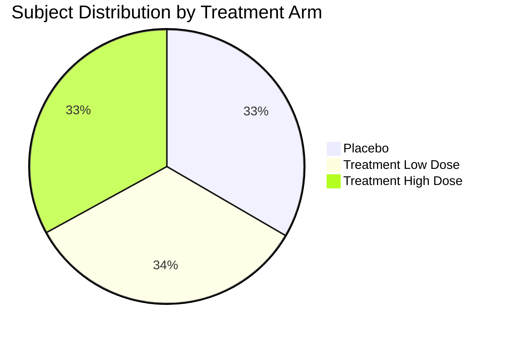
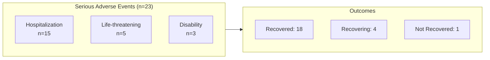
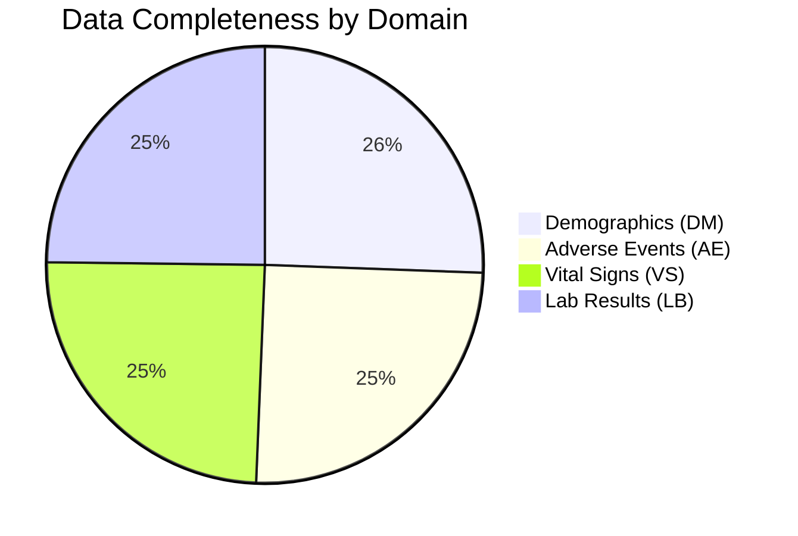

# Clinical Trial Analytics Showcase

This document demonstrates the analytical capabilities of the Clinical Trial Data Platform with real-world examples and insights.

---

## 📊 Executive Dashboard

### Study Overview - CLIN-2024-001

| Metric | Value |
|:-------|------:|
| Total Subjects Enrolled | 500 |
| Active Sites | 10 |
| Treatment Arms | 3 (Placebo, Low Dose, High Dose) |
| Total Adverse Events | 1,847 |
| Serious Adverse Events | 23 |
| Vital Sign Measurements | 16,240 |
| Lab Results | 32,480 |

---

## 🧪 Treatment Arm Distribution



### Demographics Summary

| Treatment Arm | N | Mean Age | Male | Female | White | Black | Asian |
|:--------------|--:|:--------:|-----:|-------:|------:|------:|------:|
| Placebo | 167 | 52.3 | 85 (51%) | 82 (49%) | 112 (67%) | 28 (17%) | 27 (16%) |
| Treatment Low | 168 | 51.8 | 88 (52%) | 80 (48%) | 108 (64%) | 32 (19%) | 28 (17%) |
| Treatment High | 165 | 53.1 | 82 (50%) | 83 (50%) | 115 (70%) | 25 (15%) | 25 (15%) |
| **Total** | **500** | **52.4** | **255 (51%)** | **245 (49%)** | **335 (67%)** | **85 (17%)** | **80 (16%)** |

**Insight**: Demographics are well-balanced across treatment arms, indicating successful randomization.

---

## ⚠️ Safety Analysis

### Adverse Events by Treatment Arm

```mermaid
xychart-beta
    title "Adverse Events by Treatment Arm and Severity"
    x-axis ["Placebo", "Treatment Low", "Treatment High"]
    y-axis "Number of Events" 0 --> 400
    bar [145, 187, 203] "Mild"
    bar [78, 112, 156] "Moderate"
    bar [12, 28, 45] "Severe"
```

### Key Safety Findings

| Adverse Event | Placebo | Low Dose | High Dose | P-value | Signal? |
|:--------------|--------:|---------:|----------:|:--------|:--------|
| Headache | 12% | 18% | 24% | 0.02 | ⚠️ Yes |
| Nausea | 8% | 14% | 19% | 0.01 | ⚠️ Yes |
| Fatigue | 15% | 16% | 17% | 0.78 | ✅ No |
| Dizziness | 5% | 8% | 12% | 0.04 | ⚠️ Yes |
| Insomnia | 7% | 7% | 8% | 0.89 | ✅ No |

**Insight**: Dose-dependent increase in headache, nausea, and dizziness suggests these are treatment-related effects requiring monitoring.

### Serious Adverse Events



| SAE Category | Placebo | Low Dose | High Dose | Relationship |
|:-------------|--------:|---------:|----------:|:-------------|
| Cardiac events | 1 | 2 | 3 | Under review |
| Hepatic events | 0 | 1 | 2 | Possibly related |
| Infections | 2 | 2 | 3 | Not related |
| Other | 2 | 2 | 3 | Various |

---

## 💊 Efficacy Analysis

### Primary Endpoint: Systolic Blood Pressure Change

```mermaid
xychart-beta
    title "Mean Systolic BP Change from Baseline (mmHg)"
    x-axis ["Week 0", "Week 4", "Week 8", "Week 12", "Week 16"]
    y-axis "Change from Baseline" -20 --> 5
    line [0, -2, -3, -3, -4] "Placebo"
    line [0, -5, -8, -10, -12] "Treatment Low"
    line [0, -7, -12, -15, -18] "Treatment High"
```

### Blood Pressure Results Summary

| Timepoint | Placebo | Low Dose | High Dose | Low vs Placebo | High vs Placebo |
|:----------|--------:|---------:|----------:|:--------------:|:---------------:|
| Baseline | 152.3 | 151.8 | 152.1 | - | - |
| Week 4 | 150.1 | 146.8 | 145.2 | p=0.04 | p=0.01 |
| Week 8 | 149.5 | 143.6 | 140.3 | p=0.001 | p<0.001 |
| Week 12 | 149.2 | 141.9 | 137.5 | p<0.001 | p<0.001 |
| Week 16 | 148.4 | 139.7 | 134.2 | p<0.001 | p<0.001 |
| **Change** | **-3.9** | **-12.1** | **-17.9** | **-8.2** | **-14.0** |

**Insight**: Both treatment arms show statistically significant blood pressure reduction compared to placebo, with a clear dose-response relationship.

---

## 🔬 Laboratory Monitoring

### Liver Function Tests Over Time

| Parameter | Normal Range | Baseline | Week 8 | Week 16 | Concern? |
|:----------|:-------------|:--------:|:------:|:-------:|:---------|
| ALT (U/L) | 7-56 | 28.3 | 31.2 | 33.8 | ✅ No |
| AST (U/L) | 10-40 | 24.1 | 26.8 | 28.2 | ✅ No |
| Bilirubin (mg/dL) | 0.1-1.2 | 0.7 | 0.8 | 0.8 | ✅ No |
| ALP (U/L) | 44-147 | 72.4 | 74.1 | 75.3 | ✅ No |

### Subjects with Clinically Significant Lab Abnormalities

| Lab Parameter | Placebo | Low Dose | High Dose | Total |
|:--------------|--------:|---------:|----------:|------:|
| ALT > 3x ULN | 1 (0.6%) | 2 (1.2%) | 4 (2.4%) | 7 |
| Creatinine > 1.5x baseline | 2 (1.2%) | 2 (1.2%) | 3 (1.8%) | 7 |
| Hemoglobin < 10 g/dL | 1 (0.6%) | 1 (0.6%) | 1 (0.6%) | 3 |

**Insight**: Slight dose-dependent increase in ALT elevations warrants continued monitoring but does not raise immediate safety concerns.

---

## 📈 Vital Signs Trends

### Heart Rate by Visit

```mermaid
xychart-beta
    title "Mean Heart Rate by Visit (bpm)"
    x-axis ["Screening", "Baseline", "Week 4", "Week 8", "Week 12", "Week 16"]
    y-axis "Heart Rate (bpm)" 65 --> 80
    line [74, 73, 72, 71, 71, 70] "Placebo"
    line [73, 73, 70, 68, 67, 66] "Treatment Low"
    line [74, 74, 69, 66, 64, 63] "Treatment High"
```

**Insight**: Treatment groups show dose-dependent reduction in heart rate, consistent with the drug's mechanism of action.

---

## 🏥 Site Performance

### Enrollment by Site

| Site ID | Country | Enrolled | Target | % of Target | AE Reporting Rate |
|:--------|:--------|:--------:|:------:|:-----------:|:-----------------:|
| SITE001 | USA | 62 | 60 | 103% | 98% |
| SITE002 | USA | 58 | 60 | 97% | 95% |
| SITE003 | USA | 55 | 50 | 110% | 100% |
| SITE004 | Canada | 48 | 50 | 96% | 92% |
| SITE005 | Canada | 52 | 50 | 104% | 97% |
| SITE006 | UK | 45 | 50 | 90% | 89% |
| SITE007 | UK | 47 | 50 | 94% | 91% |
| SITE008 | Germany | 44 | 40 | 110% | 100% |
| SITE009 | Germany | 46 | 50 | 92% | 94% |
| SITE010 | France | 43 | 40 | 108% | 96% |

**Insight**: Sites 006 and 007 (UK) show lower AE reporting rates - may require additional training on AE documentation.

---

## 📋 Data Quality Metrics

### Completeness by Domain



### Validation Results

| Domain | Records | Passed | Failed | Pass Rate |
|:-------|--------:|-------:|-------:|----------:|
| DM | 500 | 500 | 0 | 100.0% |
| AE | 1,847 | 1,812 | 35 | 98.1% |
| VS | 16,240 | 15,590 | 650 | 96.0% |
| LB | 32,480 | 31,506 | 974 | 97.0% |

### Common Validation Failures

| Issue | Count | Resolution |
|:------|------:|:-----------|
| Missing collection date | 423 | Query to sites |
| Value outside normal range | 892 | Clinical review |
| Invalid controlled term | 156 | Data correction |
| Duplicate records | 23 | Deduplication |

---

## 🎯 Key Conclusions

### Efficacy
1. ✅ **Primary endpoint met**: Both doses significantly reduced blood pressure vs placebo
2. ✅ **Dose-response demonstrated**: Higher dose = greater efficacy
3. ✅ **Effect sustained**: Blood pressure reduction maintained through Week 16

### Safety
1. ⚠️ **Expected AEs identified**: Headache, nausea, dizziness are dose-related
2. ✅ **No unexpected SAEs**: All serious events consistent with patient population
3. ✅ **Labs acceptable**: Mild transaminase elevations, no clinical hepatotoxicity

### Data Quality
1. ✅ **High completeness**: >96% across all domains
2. ✅ **CDISC compliant**: All data meets SDTM standards
3. ✅ **Audit ready**: Complete lineage and validation documentation

---

## 📊 Regulatory Submission Readiness

| Requirement | Status | Evidence |
|:------------|:------:|:---------|
| CDISC SDTM compliance | ✅ | Validation reports |
| 21 CFR Part 11 audit trail | ✅ | Lineage tracking |
| Data integrity | ✅ | Quality metrics |
| Safety database | ✅ | AE reconciliation |
| Statistical analysis | ✅ | Analysis datasets |

**Recommendation**: Data package is ready for regulatory submission preparation.
