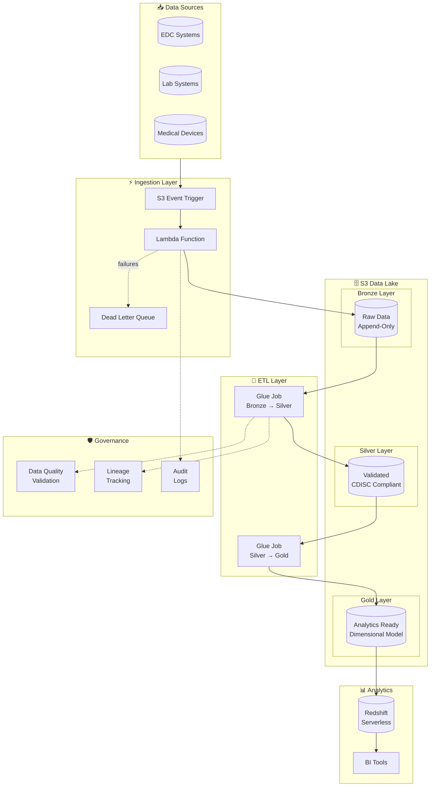
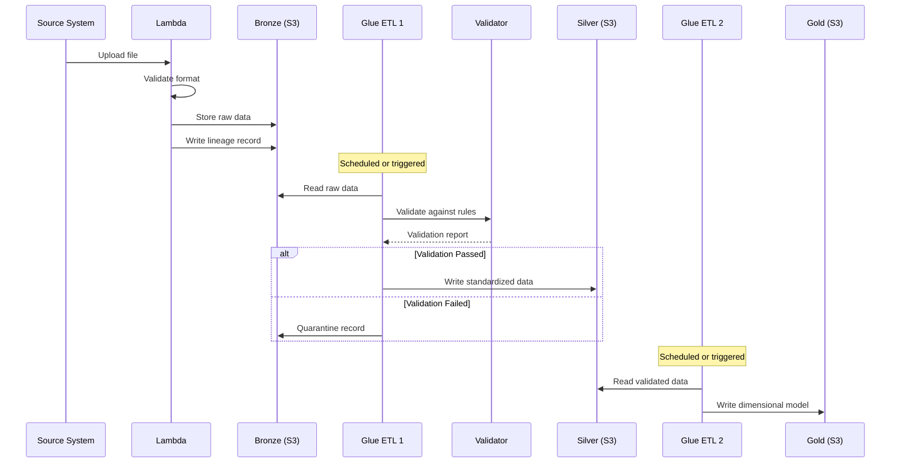
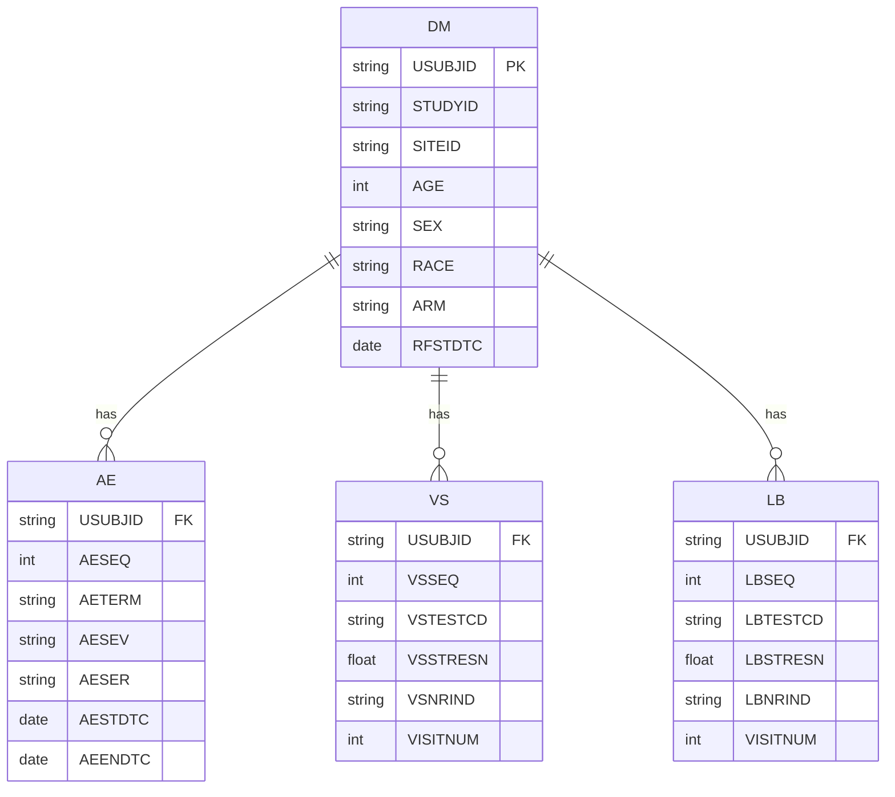
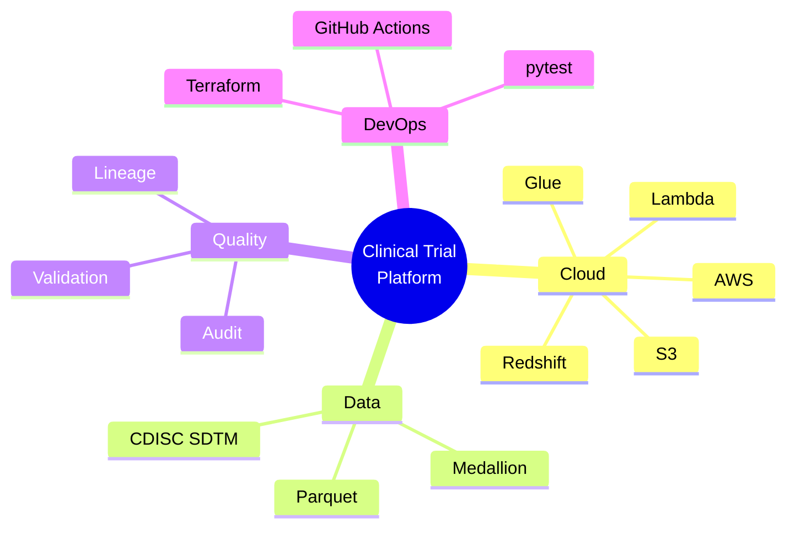

# Clinical Trial Data Platform - Architecture

## System Overview

```mermaid
flowchart TB
    subgraph Sources["📥 Data Sources"]
        EDC[("EDC Systems")]
        LAB[("Lab Systems")]
        DEV[("Medical Devices")]
    end

    subgraph Ingestion["⚡ Ingestion Layer"]
        S3E["S3 Event Trigger"]
        LAM["Lambda Function"]
        DLQ["Dead Letter Queue"]
    end

    subgraph DataLake["🗄️ S3 Data Lake"]
        subgraph Bronze["Bronze Layer"]
            BR[("Raw Data<br/>Append-Only")]
        end
        subgraph Silver["Silver Layer"]
            SL[("Validated<br/>CDISC Compliant")]
        end
        subgraph Gold["Gold Layer"]
            GL[("Analytics Ready<br/>Dimensional Model")]
        end
    end

    subgraph ETL["🔄 ETL Layer"]
        G1["Glue Job<br/>Bronze → Silver"]
        G2["Glue Job<br/>Silver → Gold"]
    end

    subgraph Analytics["📊 Analytics"]
        RS[("Redshift<br/>Serverless")]
        BI["BI Tools"]
    end

    subgraph Governance["🛡️ Governance"]
        VAL["Data Quality<br/>Validation"]
        LIN["Lineage<br/>Tracking"]
        AUD["Audit<br/>Logs"]
    end

    Sources --> S3E
    S3E --> LAM
    LAM --> BR
    LAM -.->|failures| DLQ
    BR --> G1
    G1 --> SL
    SL --> G2
    G2 --> GL
    GL --> RS
    RS --> BI

    G1 -.-> VAL
    G1 -.-> LIN
    LAM -.-> AUD
```

## Data Flow Detail

```mermaid
sequenceDiagram
    participant S as Source System
    participant L as Lambda
    participant B as Bronze (S3)
    participant G1 as Glue ETL 1
    participant V as Validator
    participant Si as Silver (S3)
    participant G2 as Glue ETL 2
    participant Go as Gold (S3)

    S->>L: Upload file
    L->>L: Validate format
    L->>B: Store raw data
    L->>B: Write lineage record
    
    Note over G1: Scheduled or triggered
    G1->>B: Read raw data
    G1->>V: Validate against rules
    V-->>G1: Validation report
    
    alt Validation Passed
        G1->>Si: Write standardized data
    else Validation Failed
        G1->>B: Quarantine record
    end
    
    Note over G2: Scheduled or triggered
    G2->>Si: Read validated data
    G2->>Go: Write dimensional model
```

## CDISC Domain Model

```mermaid
erDiagram
    DM ||--o{ AE : "has"
    DM ||--o{ VS : "has"
    DM ||--o{ LB : "has"
    
    DM {
        string USUBJID PK
        string STUDYID
        string SITEID
        int AGE
        string SEX
        string RACE
        string ARM
        date RFSTDTC
    }
    
    AE {
        string USUBJID FK
        int AESEQ
        string AETERM
        string AESEV
        string AESER
        date AESTDTC
        date AEENDTC
    }
    
    VS {
        string USUBJID FK
        int VSSEQ
        string VSTESTCD
        float VSSTRESN
        string VSNRIND
        int VISITNUM
    }
    
    LB {
        string USUBJID FK
        int LBSEQ
        string LBTESTCD
        float LBSTRESN
        string LBNRIND
        int VISITNUM
    }
```

## Technology Stack

```mermaid
mindmap
    root((Clinical Trial<br/>Platform))
        Cloud
            AWS
            S3
            Lambda
            Glue
            Redshift
        Data
            CDISC SDTM
            Parquet
            Medallion
        Quality
            Validation
            Lineage
            Audit
        DevOps
            Terraform
            GitHub Actions
            pytest
```
